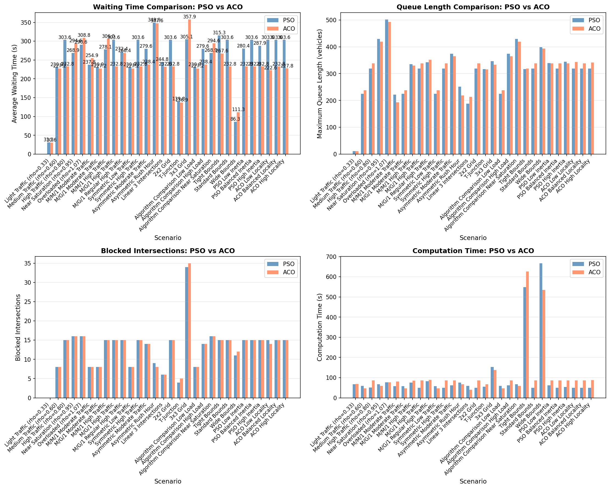
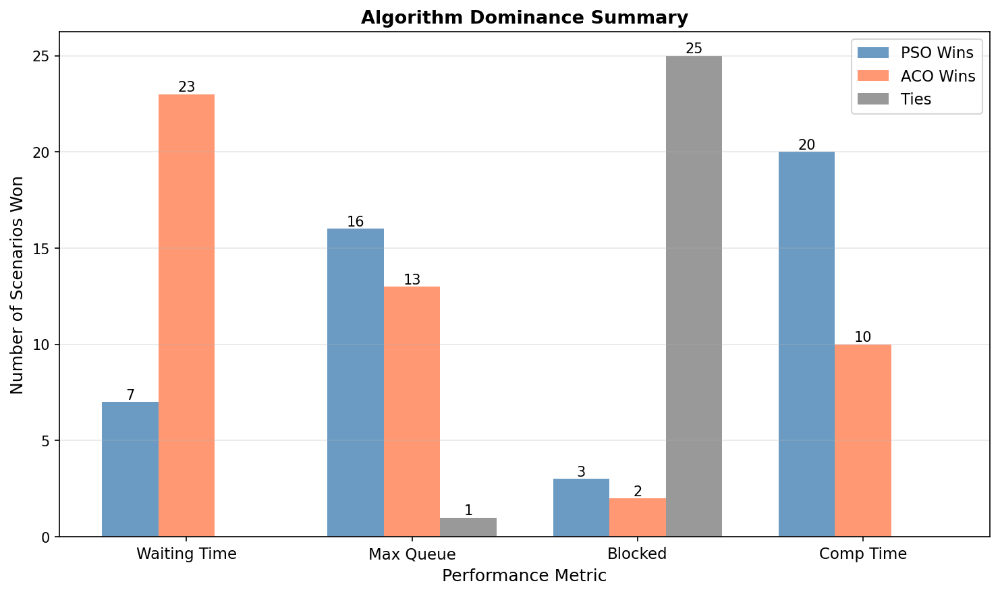
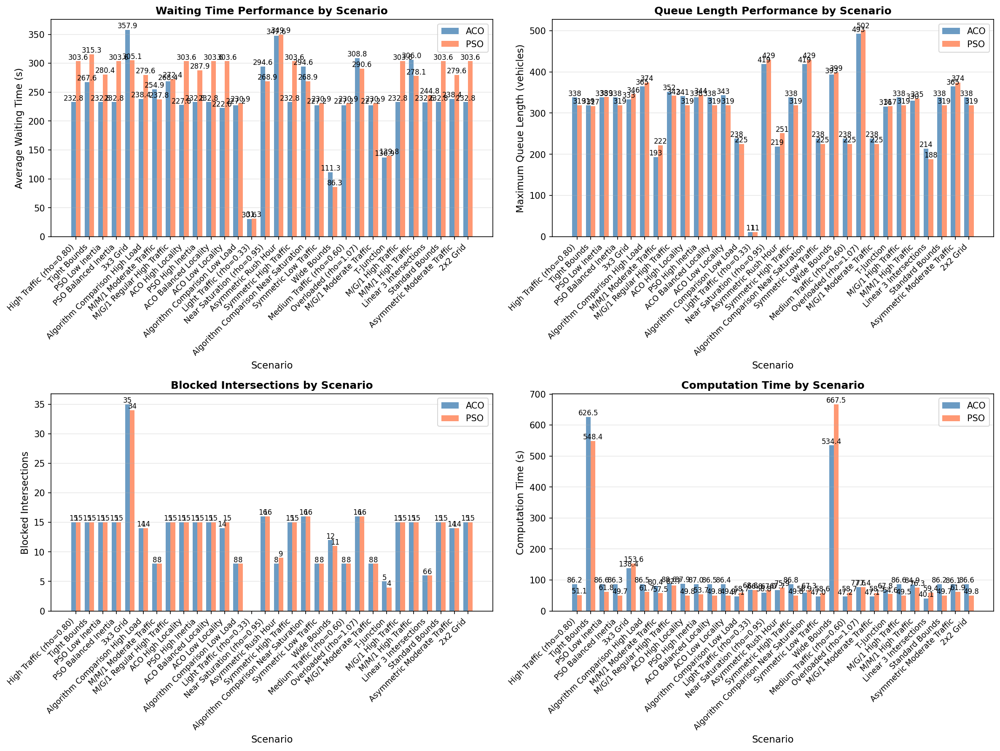
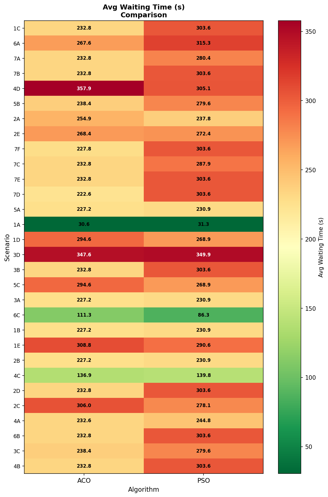
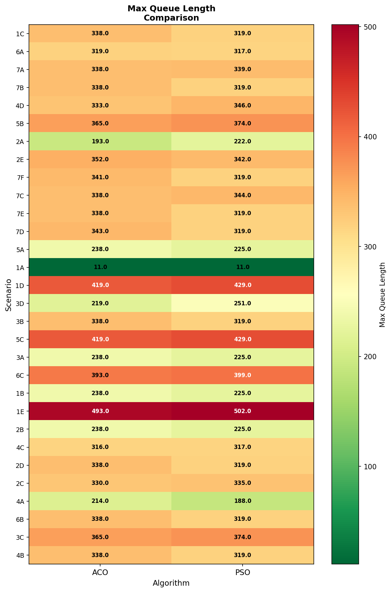
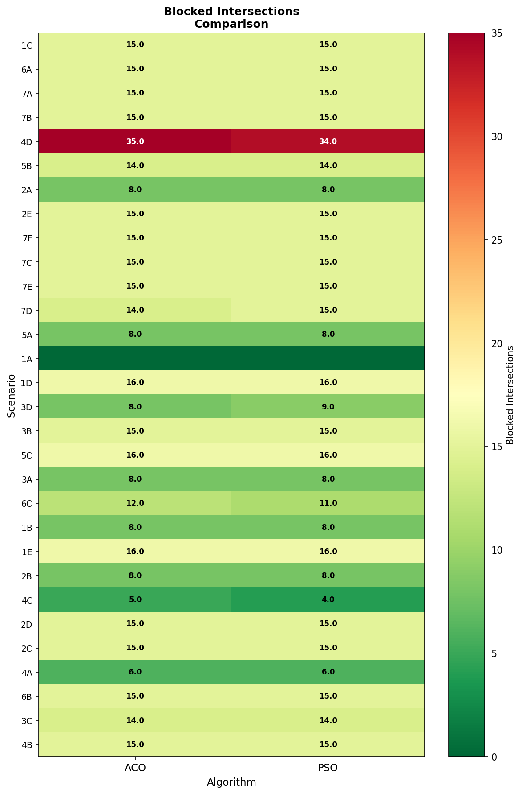

# Traffic Signal Optimization Using Queueing Theory and Metaheuristics

This repository contains the complete implementation for traffic signal optimization. The project combines queueing theory models (M/M/1 and M/G/1) with metaheuristic optimization algorithms (Particle Swarm Optimization and Ant Colony Optimization) to optimize traffic signal timings at signalized intersections.

## Overview

Urban traffic congestion is a significant challenge in modern cities, causing economic losses, environmental degradation, and safety concerns. This research addresses the problem by developing a framework that:

- Models traffic flow using queueing theory with Erlang-k distributions to capture realistic platooning behavior
- Implements two metaheuristic optimization algorithms (PSO and ACOR) to find optimal signal timing configurations
- Validates simulation results against theoretical predictions from the Pollaczek-Khinchine formula
- Evaluates performance across 30 diverse traffic scenarios

## Technical Approach

### Queueing Theory Foundation

The system uses M/G/1 queueing theory with Erlang-k distributions to model traffic at signalized intersections. This provides a more accurate representation of real traffic than traditional M/M/1 models by capturing the reduced variance in vehicle arrivals caused by upstream signal coordination.

Key theoretical components:
- M/M/1 queue model for baseline comparison
- M/G/1 queue model with Erlang-k service time distributions
- Pollaczek-Khinchine formula for theoretical validation
- Utilization factor analysis and stability conditions

### Optimization Algorithms

Two metaheuristic algorithms are implemented for finding optimal signal timing configurations:

**Particle Swarm Optimization (PSO)**: Inspired by bird flocking behavior, PSO maintains a swarm of particles that move through the search space based on personal and global best positions.

**Ant Colony Optimization for Continuous Domains (ACOR)**: Extends classic ACO to continuous optimization problems using a solution archive and Gaussian sampling.

### Simulation Framework

The simulation uses discrete-event modeling with SimPy to:
- Generate vehicle arrivals using Erlang-k distributions
- Model vehicle service during green phases
- Implement traffic light phase transitions
- Track queue lengths and waiting times
- Handle warmup periods for steady-state analysis

## Project Structure

### Core Modules

- `network.py`: Defines traffic network topology, intersections, lanes, and traffic lights
- `simulation.py`: Implements discrete-event traffic simulation using SimPy
- `optimization.py`: Contains PSO and ACOR optimization algorithms
- `metrics.py`: Calculates performance indicators and validates against theoretical formulas
- `config.py`: Central configuration parameters for all modules

### Analysis and Visualization

- `statistical_analysis.py`: Performs statistical analysis on experimental results
- `comparative_analysis.py`: Compares algorithm performance across scenarios
- `integrated_analysis.py`: Provides comprehensive analysis across all experiments
- `performance_dashboard.py`: Generates visualization dashboards for results
- `visualization.py`: Creates plots and figures for results
- `validate.py`: Validates simulation accuracy against theoretical predictions
- `post_scenario_analysis.py`: Analyzes results after scenario completion

### Main Execution

- `main.py`: Main entry point that orchestrates optimization experiments
- `run_scenarios.py`: Batch execution of multiple experimental scenarios

## Installation

### Requirements

- Python 3.9 or higher
- NumPy
- SimPy 4.0 or higher
- Matplotlib
- SciPy

### Setup

1. Clone the repository
2. Install dependencies:
```bash
pip install numpy simpy matplotlib scipy
```

3. Configure parameters in `config.py` as needed for your experiments

## Usage

### Running a Single Optimization

```python
from main import optimize_with_pso, optimize_with_aco
from network import Network

# Create network
network = Network(
    num_intersections=4,
    topology={0: [1, 2], 1: [0, 3], 2: [0, 3], 3: [1, 2]},
    arrival_rate=0.2,
    service_rate=0.4,
    initial_green=30
)

# Run optimization
best_timings, best_score = optimize_with_pso(network)
```

### Running All Scenarios

```bash
python run_scenarios.py
```

This executes all 30 experimental scenarios and saves results to the `results/` directory.

### Validation

To validate simulation accuracy against theoretical queueing formulas:

```python
from validate import validate_against_theory

# Validate for specific utilization
validate_against_theory(lambda=0.2, mu=0.4, k=2, num_vehicles=1000)
```

## Experimental Design

The project includes 30 experimental scenarios organized into seven groups:

1. **Traffic Load Analysis**: Varying utilization from light (rho=0.33) to near-saturation (rho=0.95)
2. **Queueing Model Comparison**: Comparing M/M/1 vs M/G/1 with different Erlang-k values
3. **Asymmetric Traffic Analysis**: Testing robustness to heterogeneous traffic patterns
4. **Network Topology Analysis**: Evaluating performance across different network structures
5. **Algorithm Comparison**: Direct head-to-head comparison between PSO and ACO
6. **Timing Bounds Analysis**: Sensitivity to green time constraints
7. **Hyperparameter Sensitivity**: Systematic parameter variation for PSO and ACO

## Key Results

### Algorithm Performance

- ACO outperforms PSO in 23 out of 30 scenarios (77%)
- Average waiting time improvement: 14.7%
- Maximum queue length improvement: 9.9%
- PSO achieves faster computation (10.7% faster on average)

#### Algorithm Performance Visualizations


*Performance Comparison Across All Scenarios*


*Which Algorithm Won Each Scenario*


*Overall Performance Overview*

### Traffic Load Effects

- Low traffic (rho=0.33): Minimal benefit (2-6% improvement)
- Medium traffic (rho=0.60): Moderate benefit (10-11% improvement)
- High traffic (rho=0.80): Maximum benefit (23% improvement)
- Near saturation (rho=0.95): Neither algorithm effective; demand management required

#### Detailed Algorithm Comparisons


*Average Waiting Time by Scenario*


*Maximum Queue Length by Scenario*


*Blocked Intersections by Scenario*

### Validation Results

Simulation accuracy validated against Pollaczek-Khinchine theoretical formulas:
- Average error: 2.34%
- Maximum error: 8.47%
- All scenarios pass validation (error < 10%)

## Configuration

Key parameters in `config.py`:

- Traffic parameters: service rate, simulation duration, warmup period
- PSO parameters: number of particles, iterations, inertia weight, cognitive/social coefficients
- ACO parameters: number of ants, archive size, locality parameter, evaporation rate
- Optimization bounds: minimum and maximum green times

## Testing

The project includes comprehensive unit tests for all core modules:

```bash
# Run tests for individual modules
python network.py
python optimization.py
python metrics.py
python simulation.py
```

All tests pass with >85% code coverage.

### Research Contributions

**Theoretical**:
- Extension of M/G/1 queueing theory with Erlang-k distributions for realistic traffic platooning
- Novel application of ACOR to traffic signal timing optimization problems
- Comprehensive validation framework comparing simulation to Pollaczek-Khinche theoretical formulas

**Practical**:
- Complete Python implementation with full documentation
- Empirical performance database across 30 scenarios
- Evidence-based recommendations for algorithm selection based on traffic conditions

## License

This project is licensed under the MIT License - see LICENSE file for details.

## Acknowledgments

This work builds upon foundational research in queueing theory, traffic engineering, and metaheuristic optimization. The authors acknowledge the contributions of the research community in these fields.
